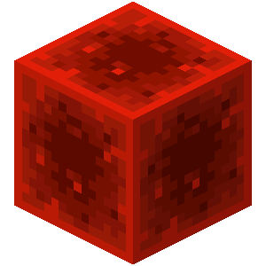

<p align="center">
  
  <br />
  <br />
  <a href="https://huggingface.co/datasets/microsoft/RedStone"></a>
  <a href="https://xxx"></a>
  <a href="https://github.com/microsoft/RedStone/blob/main/LICENSE"></a>
</p>

--------------------------------------------------------------------------------

# [REDSTONE : Curating General, Code, Math, and QA Data for Large Language Models](xxx)

**RedStone** is an innovative and scalable pipeline designed to extract and process data from a vast amount of web content, facilitating the creation of diverse and comprehensive pre-training datasets. We demonstrate its capabilities by building pre-training datasets across multiple domains, including general, code, mathematics, and question-answering. REDSTONE's flexibility allows it to easily adapt to various specialized fields.

# Dataset
| Datasets        | Tokens (B) |
|-----------------|------------|
| REDSTONE-Web    | 3,170.2    |
| REDSTONE-Code   | 250.2      |
| REDSTONE-Math   | 15.9       |
| REDSTONE-QA     | 51.4       |


**Note：** Since **we do not have the permission to open-source the processed data**, We provide all the code for RedStone to process both general and domain-specific data, along with an [index](https://huggingface.co/datasets/microsoft/RedStone) for high-quality data from Common Crawl after filtering. You can download the raw Common Crawl data, use the provided index to find high-quality pages, and process them with RedStone's scripts.

If you have the appropriate licenses, **we encourage you to use these scripts to reproduce the dataset and contribute it to the open-source community**. We will reference the data here for easy access. Additionally, we welcome you to use RedStone to expand domain-specific categories beyond just code, math, and QA.

# Performance
### General Domain Data
| Datasets      | ARC-c | ARC-e | HellaSwag | OpenBookQA | PIQA  | Winogrande | AVERAGE |
|---------------|-------|-------|-----------|------------|-------|------------|---------|
| RedPajama     | 0.2270| 0.4386| 0.3171    | 0.1900     | 0.5968| **0.5296** | 0.3832  |
| FineWeb       | 0.1928| 0.4428| 0.3506    | 0.1740     | 0.6681| 0.5288     | 0.3929  |
| RefinedWeb    | 0.2125| 0.4369| 0.3380    | 0.2100     | 0.6491| 0.5264     | 0.3955  |
| DCLM          | 0.2159| 0.4848| 0.3614    | 0.1760     | 0.6615| 0.5082     | 0.4013  |
| FineWeb-Edu   | **0.2722**| **0.5648**| 0.3637    | 0.1940     | 0.6676| 0.5051     | 0.4279  |
| **REDSTONE-Web**  | 0.2662| 0.5181| **0.3722**| **0.2340** | **0.6795**| 0.5162     | **0.4310** |

<sub>**The results are based on models trained with 1.3 billion parameters on 50 billion tokens.**</sub>

### Domain-specific Data
#### REDSTONE-Code
| Dataset         | HumanEval pass@1 | HumanEval pass@10 | MBPP pass@1 | MBPP pass@10 |
|-----------------|------------------|-------------------|-------------|--------------|
| REDSTONE-Web    | 0.0125           | 0.0168            | 0.0751      | 0.1566       |
| + **REDSTONE-Code** | **0.0555**       | **0.1035**        | **0.1311**  | **0.2458**   |

#### REDSTONE-Math
| Dataset                    | GSM8k  | MATH   |
|----------------------------|--------|--------|
| OpenWebMath       | 3.2503 | 3.1288 |
| **REDSTONE-Math**              | **3.1125** | **3.0557** |

#### REDSTONE-QA
| Model               | MMLU  | Arc Challenge | Arc Easy | OpenbookQA | Winogrande | AVERAGE |
|---------------------|-------|---------------|----------|------------|------------|---------|
| StableLM-2-1.6B     | 0.3135| 0.3481        | **0.6860**| 0.2780     | 0.6354     | 0.4522  |
| + FALN v2           | 0.3525| 0.3601        | 0.6406   | **0.2860** | 0.6125     | 0.4503  |
| + Open Orca         | 0.3569| 0.3089        | 0.5821   | 0.2660     | 0.5675     | 0.4163  |
| + **REDSTONE-QA**       | **0.4582**| **0.3643**| 0.6839   | 0.2760     | **0.6377** | **0.4840** |

**<sub>For evaluations on the domain-specific dataset, We utilized the same architecture as the StableLM-2-1.6B</sub>**

# Getting Started

| Domain | Link |
|----------------------|--------------------------------------------------------------------------------------------|
| General Domain Data  |[Getting Started](https://github.com/microsoft/RedStone/blob/main/GeneralDomain/README.md)  | 
| Domain-specific Data |[Getting Started](https://github.com/microsoft/RedStone/blob/main/DomainSpecific/readme.md) |

# Responsible AI FAQ
- **What is RedStone Source Code?**
    - RedStone is a pipeline designed to extract a wide range of specified knowledge from Common Crawl on a large scale. It is composed of three modules, Collection, Filtering and Extraction. As an example, we use RedStone to build extensive domain-specific datasets in the fields of code, mathematics, question answering (QA), and general data. Utilizing RedStone, it is possible to easily acquire valuable knowledge from a multitude of other domains within Common Crawl.
- **What can RedStone Source Code do?**
    - RedStone Source Code provides the sample codes of the pipeline’s components, workflow and index of source location, enabling anyone to construct large-scale various domains from Common Crawl, including general web content, web code, web mathematics and web QA data.
- **What is/are RedStone Source Code’s intended use(s)?**
    - We release RedStone, aiming to provide this resource to the research community to accelerate the development of large language models and for demonstrating a novel method of constructing training datasets. Given the research nature of this work, production or commercial uses are out of scope without further testing and mitigation.
- **How was RedStone Source Code evaluated? What metrics are used to measure performance?**
    - We use RedStone to build domain-specific datasets in the fields of code, mathematics, question answering (QA), and general datasets as examples. We evaluate the performance of the datasets across multiple benchmarks, demonstrating that RedStone significantly enhances model performance in mathematics, code, and QA tasks.
- **What are the limitations of [RedStone Source Code]? How can users minimize the impact of RedStone dataset’s limitations when using the system?**
    - RedStone takes several domains as examples to verify the methodologies and pipelines. We believe the ways should work for other fields. However, the source code repo is customized for these domain and English materials only. It takes extra effort to revise the codes for your tasks and setting if you would like to obtain data of different domain, languages with your environment.
    - RedStone employs quality filters to get content with correct grammar, logical consistency, and factual accuracy. Despite our efforts to remove toxic content, some harmful content may be present.
    - RedStone used scope of deduplication, which indicates that narrowing the scope of deduplication yields the highest scores. A possible explanation is that a narrower deduplication scope results in a data distribution that more closely mirrors the real world, where frequently occurring data in real life also appears multiple times in the dataset. However, we are currently unable to verify this hypothesis and will investigate it.
    - There might be incorrect data in raw data that could not be filtered out, which may result in inaccurate answers for some questions.
    - Common Crawl data may not be suitable for all downstream uses due to copyright or other legal reasons. Users are responsible for verifying the legal right to use Common Crawl data for their intended purpose.
- **What operational factors and settings allow for effective and responsible use of RedStone Source Code?**
    - The user is responsible for validating the safety and accuracy of any datasets developed using RedStone Source Code, or any model developed using a dataset constructed using our methods.

# Citation
If you find this repository useful, please consider citing our work:
```
xxx
```

# License
The content of this project itself is licensed under the [MIT](./LICENSE)

[Microsoft Open Source Code of Conduct](https://opensource.microsoft.com/codeofconduct)

# Contact
For help or issues using RedStone, please submit a GitHub issue.

For other communications related to RedStone, please contact [Lei Cui](mailto:lecu@microsoft.com) or [Furu Wei](mailto:fuwei@microsoft.com).


